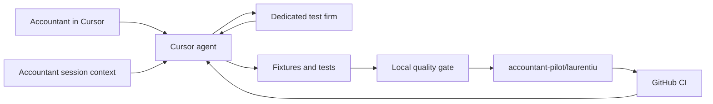

# Accountant-driven Markus improvement loop

This file is the Cursor Plan we follow. Cursor stores Plan-mode files only under `~/.cursor/plans/` (this one is `accountant-pilot-loop_f2ca5d6e.plan.md`); they are not in git unless copied into the repo.

**Amendments after this plan (body below is the original):**

- Checkpoints publish to the current `ap/<name>` branch (any slug: `ap/laurentiu`, `ap/maria`, …). No person name is hardcoded. The original text’s `accountant-pilot/laurentiu` is an example of an older naming scheme.
- No CodFirma allowlist. The accountant uses test accounts; Markus does not abort writes for a “wrong firm.” The fail-closed pilot-firm check and `test-firm-guard` todo are superseded.
- A closed working month is a warning, not a Markus write veto. After explicit confirm, proceed; SAGA may still refuse. Screen rights remain a hard block.

## Architecture

Do not call this “self-learning” in product promises: the model is not retrained. The durable loop is accountant feedback → reproducible scenario → test/fixture → minimal implementation → verification → checkpoint commit.

## Engineer-provided prerequisites (out of implementation scope)

The engineer handles cloning, `accountant-pilot/laurentiu`, GitHub authentication/protection, Cursor installation, MCP registration against the editable checkout, credentials, and the dedicated SAGA/SmartBill test environment. This plan neither automates nor modifies that setup.

The repository assumes the engineer provides a non-secret pilot configuration containing the expected test-firm code and checkpoint timing. Until the active [credential broker plan](local-credential-isolation.md) ships, use disposable test-only credentials—never production credentials or documents.

Repository code still adds a fail-closed pilot-firm check in SAGA mutation preflight: every write aborts if the connected firm does not match the engineer-configured test firm; all existing `confirm_write=false → explicit confirmation → true` gates remain.

## 1. Activate accountant context without relying on a phrase

“I am an accountant” is a useful signal, but phrase-triggered rules are best-effort. Make activation automatic on Laurentiu’s configured checkout:

- Commit a concise shared context document (e.g. [`.cursor/accountant-context.md`](../accountant-context.md)) describing plain-language interaction, one question at a time, test-firm-only behavior, and the feedback-to-test loop.
- Provide the tracked context and the exact `sessionStart` payload/contract; the engineer manually installs any **user-level** Cursor hook and validates the expected checkout. Repository implementation does not alter the accountant's Cursor configuration.
- Add an always-applied universal rule under [`.cursor/rules/`](../rules/) for repository-wide regression and safety invariants. Keep it under 50 lines and applicable to developers too.
- Optional fallback: a project `/accountant-pilot` skill. The accountant may still open with “I am an accountant,” but correctness must not depend on that phrase.

Accountant-facing behavior: complete the requested flow first; do not expose code jargon unless asked; when corrected, ask for the expected accounting outcome and verify it rather than blindly agreeing.

## 2. Turn every valid correction into durable evidence

Add a required workflow to the context/rule:

1. Reproduce on the dedicated test firm and classify the issue: code defect, SAGA/session state, bad input, missing feature, or misunderstanding. Do not modify code for non-code failures.
2. Capture only sanitized/synthetic evidence—never client names, CIFs, passwords, tokens, cookies, or production documents.
3. For deterministic logic, add a failing unit test/fixture before or with the fix. For browser-only behavior, add a sanitized scenario under `tests/accountant_scenarios/` plus the narrowest mocked regression test possible.
4. Make the smallest scoped change; do not weaken/delete an existing test merely to pass.
5. Run the focused test, then the full quality gate. Reload Cursor MCP before repeating a live flow because the running stdio process retains imported code.
6. Record the outcome and test evidence in a compact tracked pilot finding log; unresolved or uncertain accounting behavior stays open rather than becoming guessed code.

Add baseline coverage before the pilot for current high-risk gaps: SmartBill conversion/status, MCP catalog/import smoke, and sanitization of captured artifacts.

## 3. Establish one shared regression gate locally and in CI

- Add a single repository command/script (e.g. [`scripts/quality_gate.py`](../../scripts/quality_gate.py)) used by both the agent and CI: compile/import smoke, full `unittest` discovery, catalog checks, and secret/path scanning of changed tracked files.
- Add [`.github/workflows/test.yml`](../../.github/workflows/test.yml) on push and pull request, at minimum on Windows and Linux with supported Python versions. The existing [`build-installers.yml`](../../.github/workflows/build-installers.yml) remains release-only, but installer jobs must depend on the same tests before uploading artifacts.
- Add a non-mutating MCP smoke after reload: `health_check`, tool catalog, and expected core tool names. Live SAGA writes remain manual against the test firm, never CI.
- Have `health_check` expose a non-secret source revision/startup fingerprint so the agent can detect a stale MCP process and give Laurentiu one plain instruction to reload it.

No process can guarantee zero regressions; these gates make regressions detectable and prevent known-red code from being published.

## 4. Batch commits and restrict publishing

Add [`scripts/accountant-checkpoint.py`](../../scripts/accountant-checkpoint.py) as the only documented publishing route:

- Verify repository identity, exact branch `accountant-pilot/laurentiu`, upstream `origin/accountant-pilot/laurentiu`, and reject `main`/`master`, detached HEAD, force push, tag push, branch deletion, or a branch that is behind remote.
- Refuse secrets, credentials, session profiles, downloaded production artifacts, or failing tests.
- Commit only a coherent green batch with a summary tied to the feedback scenarios; push only `HEAD:refs/heads/accountant-pilot/laurentiu` without force.
- Checkpoint after at least two hours of accumulated work or at a meaningful session-end milestone; never push partial/failing work merely because three hours elapsed. Keep the last successful checkpoint timestamp outside Git in the local sentinel/state.
- Provide the expected fail-closed `beforeShellExecution` policy for the engineer to configure in Cursor: deny raw `git commit`, `git push`, branch switching, force/reset/rebase commands during pilot mode and direct the agent to the checkpoint script. This is accidental-misuse protection, not the server-side boundary.
- After each push, inspect the GitHub Actions run; if red, diagnose/fix locally and publish the next green checkpoint. No automatic merge and no PR during this pilot, per your choice.

The engineer owns GitHub protection for `main` and release tags. Local rules cannot enforce branch security against a determined same-user process; GitHub protection is the real boundary.

## 5. Accountant handoff and repository acceptance

- Add a plain-language accountant quick-start: open the configured Markus checkout, start Agent chat, describe the accounting task, confirm previews, and report what was wrong/expected. No terminal or Git instructions.
- Repository acceptance: once the engineer-provisioned context is active, a fresh chat enters accountant mode; wrong-firm writes fail; a reported defect becomes sanitized regression evidence and a passing fix; MCP reload is detected; local and CI gates pass; batched commits land only on the pilot branch; production data/credentials never enter Git or chat.
