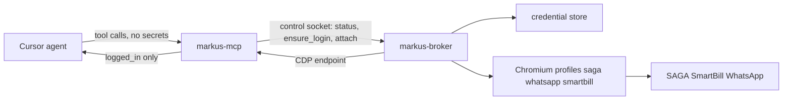

# Credential broker

The agent must never see a password. Today it could `Read` `~/.markus/private.data`, and `saga_login` / `health_check` even return that path. Moving the file to the OS keychain is not enough: Windows Credential Manager has no per-application ACL (any process running as you can `CredRead`), and the agent can patch the MCP source that reads the store.

So credentials move **out of the MCP process** into a broker that logs in and shares only the resulting session.

## Control socket

Unix domain socket `~/.markus/run/broker.sock` (mode `0600`); Windows named pipe with an owner-only ACL. JSON lines.

- `status(platform)` -> booleans only (`logged_in`, `firm_selected`, `paired`, `configured`)
- `ensure_login(platform)` -> performs login; returns `{ok, needs_otp, needs_browser_authorization}`
- `attach(platform)` -> CDP endpoint for the running browser
- `submit_otp(platform)` -> broker asks the **user** via a local dialog; the code never crosses the MCP boundary as data
- There is deliberately **no** `get_credential` / `dump` method

## Browser handover (CDP)

Broker launches each profile with `launch_persistent_context` (as [`session.py`](src/markus_mcp/tools/saga/session.py) and [`whatsapp_web.py`](src/markus_mcp/tools/whatsapp_web.py) do today) plus remote debugging on `127.0.0.1`. Markus attaches with `playwright.chromium.connect_over_cdp(...)`.

CDP handover is chosen over exporting cookies because SAGA's ~3-month "Autorizează browser" trust is tied to the persisted profile; re-homing cookies into a second profile risks re-triggering authorization.

Open design point: Chromium's DevTools endpoint is a loopback **TCP** port, so knowing the port plus the browser GUID is enough to attach. Phase 1 mitigation is that the endpoint is only disclosed through the ACL'd control socket. Phase 2 should either require a token header on `connect_over_cdp` or have the broker relay the websocket through the socket it already guards.

## MCP changes

- `_ensure_browser()` in [`session.py`](src/markus_mcp/tools/saga/session.py) becomes: ask the broker to ensure login, then `connect_over_cdp`. The worker-thread model stays.
- `load_credentials()` disappears from the MCP process; [`tools/saga/credentials.py`](src/markus_mcp/tools/saga/credentials.py) and [`tools/smartbill/credentials.py`](src/markus_mcp/tools/smartbill/credentials.py) become broker clients.
- Drop `credentials_file` / `source_file` from [`session.py`](src/markus_mcp/tools/saga/session.py), [`health.py`](src/markus_mcp/tools/health.py), [`smartbill/status.py`](src/markus_mcp/tools/smartbill/status.py).
- Keep `_redact_secrets` on network captures.
- No MCP tool takes `password=` or `token=`.

Two side effects worth having on their own: the SAGA session **survives MCP reloads** (today a reload kills the browser and forces re-login), and a single owner of the profile ends the contention that forced `saga_reset_session` when sidecar scripts needed the browser.

## Phase 1 — same-user broker

- Ship `markus-broker` as a separate binary installed **outside the git workspace** (`~/.markus/bin/`), so the agent is not editing the code that holds the secret.
- Credentials in the OS store (macOS Keychain, Windows Credential Manager), written by the installer and by `--set-credentials` over stdin ([`bootstrap.py`](src/markus_mcp/bootstrap.py), [`prompt-credentials.ps1`](packaging/windows/prompt-credentials.ps1)).
- Migrate leftover `private.data` passwords into the store on first run, then delete those keys from the file. Non-secrets (username, CIF) may stay.

Blocks: reading a password file, patching MCP source, secrets in tool JSON. Does **not** block a same-user agent that calls `CredRead` on Windows or overwrites `~/.markus/bin/markus-broker`.

## Phase 2 — dedicated OS account

- macOS: launchd daemon as a service user. Windows: service under a dedicated/virtual service account.
- Storage simplifies: once the broker is a different account, a `0600` file owned by that account is sufficient. No keychain ACL gymnastics.
- Prompts (OTP, "Autorizează browser", WhatsApp QR) must reach the user's desktop: the broker requests them over the control socket, a dialog opens in the user session, and the value goes back over the socket. It is never an MCP tool argument.
- Installer needs admin at install time, auto-start, and an upgrade path.

This is the only configuration where "the agent cannot read the password" is literally true.

## Also in scope

- `MARKUS_LLM_API_KEY` / `OPENAI_API_KEY` are read from the environment in [`fx_invoice_pdf.py`](src/markus_mcp/tools/saga/fx_invoice_pdf.py) (lines 358-366). Environment variables are dumpable from Shell; move behind the broker or drop the feature.
- Rotate credentials already exposed in chat transcripts (the SmartBill password). New storage does not un-leak an old secret.
- Cursor rule plus a skills rewrite: MCP loads credentials, never Read credential files, never `security` / `cmdkey` dumps, never ask the user to paste passwords. Stop naming `private.data` as the password location in [`server.py`](src/markus_mcp/server.py) instructions and every SKILL.md.

## Tests

- Broker socket responses and MCP tool JSON cannot contain secret values (fixture assertions).
- After migrate, parsed `private.data` has no password/token keys.
- Capture redaction still strips `Password=`.
- Broker client is faked in CI; no live Keychain, no live browser.

## Honest limit

Anyone holding a CDP attach controls the session: they can act in SAGA and read cookies via `Network.getAllCookies`. The broker protects the **password**, not the session. Revocation means killing the browser. Phase 1 is hardening; phase 2 is the boundary.

Version: bump to **0.13.0** (new component, installer change).
