# Job Search Agent — Architecture & Implementation Plan

## Overview

A production-ready Python agentic system that automates searching Romanian job boards, extracting hiring companies, finding their LinkedIn profiles, identifying key executives (CEO, CFO, Director General), and writing the results to a CSV spreadsheet. The agent uses a ReAct-style loop orchestrated by a DeepSeek LLM with a fallback chain for LinkedIn data retrieval.

---

## 1. Project Structure

```
Markus/
├── .env.example              # Template for environment variables
├── requirements.txt          # Python dependencies
├── README.md                 # Setup and usage documentation
├── main.py                   # Entry point — loads env, initialises agent, runs loop
├── config.py                 # Centralised config loader (env vars)
├── agent.py                  # ReAct agent loop + state management
├── state.py                  # State dataclasses / models
├── llm.py                    # LLM client wrapper (OpenAI-compatible for DeepSeek)
├── tools/
│   ├── __init__.py
│   ├── scraper.py            # crawl4AI wrapper — job board scraping + Google search
│   ├── company_extractor.py  # LLM-based company name extraction from job content
│   ├── linkedin_finder.py    # LinkedIn company URL finder (fallback chain + LLM validation)
│   ├── people_name_finder.py # Internet search for C-suite names by company
│   ├── people_profile_finder.py  # LinkedIn profile finder by name + company (fallback chain + LLM validation)
│   └── writer.py             # CSV writer
└── plans/
    └── architecture-plan.md  # This file
```

---

## 2. Revised Workflow — Decision Graph

The agent follows a branching decision graph rather than a straight pipeline. At each decision point, the agent logs its current phase, what it found or failed to find, and what it will attempt next.

```mermaid
flowchart LR
    subgraph INIT[Initialisation]
        A[Start] --> B[Load .env + init AgentState]
    end

    subgraph PH1[Phase 1: Job Search]
        B --> C{Select keyword}
        C --> D[Scrape ejobs.ro]
        C --> E[Scrape bestjobs.eu]
        D --> F{Parse results}
        E --> F
        F --> G{CAPTCHA detected?}
        G -->|Yes| H[PAUSE - request human input]
        H --> D
        G -->|No| I[Extract job title, URL, content]
        I --> J{More keywords?}
        J -->|Yes| C
        J -->|No| K[All jobs collected]
    end

    subgraph PH2[Phase 2: Company Extraction]
        K --> L{Next job content}
        L --> M[LLM: extract company name]
        M --> N{Deduplicate}
        N --> O{More jobs?}
        O -->|Yes| L
        O -->|No| P[Companies list ready]
    end

    subgraph PH3[Phase 3: LinkedIn Company Search]
        P --> Q{Next company}
        Q --> R[Fallback 1: Google crawl4AI]
        R --> S{Found URL?}
        S -->|Yes| T[LLM Validate]
        S -->|No| U[Fallback 2: linkedin-scraper]
        U --> V{Found URL?}
        V -->|Yes| T
        V -->|No| W[Fallback 3: Linkup API]
        W --> X{Found URL?}
        X -->|Yes| T
        X -->|No| Y[Fallback 4: LLM direct knowledge]
        Y --> Z{Found URL?}
        Z -->|Yes| T
        Z -->|No| AA[Mark LinkedIn not found]
        T --> AB{LLM says valid?}
        AB -->|Yes| AC[Store URL]
        AB -->|No| U
        AA --> AD{More companies?}
        AC --> AD
        AD -->|Yes| Q
        AD -->|No| AE[LinkedIn companies ready]
    end

    subgraph PH4[Phase 4: People Name Discovery]
        AE --> AF{Next company}
        AF --> AG[Google: CEO of X]
        AF --> AH[Google: CFO of X]
        AF --> AI[Google: Director General of X]
        AF --> AJ[Google: X leadership team]
        AG --> AK[LLM: parse names]
        AH --> AK
        AI --> AK
        AJ --> AK
        AK --> AL{More companies?}
        AL -->|Yes| AF
        AL -->|No| AM[People names ready]
    end

    subgraph PH5[Phase 5: LinkedIn Profile Discovery]
        AM --> AN{Next person}
        AN --> AO[Fallback 1: Google crawl4AI]
        AO --> AP{Found profile?}
        AP -->|Yes| AQ[LLM Validate profile]
        AP -->|No| AR[Fallback 2: linkedin-scraper]
        AR --> AS{Found profile?}
        AS -->|Yes| AQ
        AS -->|No| AT[Fallback 3: Linkup API]
        AT --> AU{Found profile?}
        AU -->|Yes| AQ
        AU -->|No| AV[Fallback 4: LLM direct knowledge]
        AV --> AW{Found profile?}
        AW -->|Yes| AQ
        AW -->|No| AX[Leave LinkedIn empty]
        AQ --> AY{LLM says valid?}
        AY -->|Yes| AZ[Store profile URL]
        AY -->|No| AR
        AX --> BA{More people?}
        AZ --> BA
        BA -->|Yes| AN
        BA -->|No| BB[People profiles ready]
    end

    subgraph PH6[Phase 6: Write Output]
        BB --> BC[Build CSV rows]
        BC --> BD[Append to output.csv]
        BD --> BE[Print summary + errors]
    end
```



---

## 3. Component Details

### 3.1 — Phase 1: Job Search and Content Extraction (`tools/scraper.py`)

**Technology:** crawl4AI (async Python library)

**Responsibilities:**
- Accept a list of keywords (e.g., `["call center", "operator introducere date"]`)
- For each keyword, search:
  - `ejobs.ro` — construct search URL with keyword
  - `bestjobs.eu` — construct search URL with keyword
- Parse the HTML/search results to extract:
  - Job title
  - Job detail URL
  - Full markdown/text content of the job page
- Handle pagination (first page minimum, subsequent pages optionally)
- **CAPTCHA detection:** if a CAPTCHA challenge page is detected, return a special status `{"captcha": True, "message": "..."}` and the agent loop pauses for human input via `input()`.

**Key functions:**
- `async search_jobs(keywords: list[str]) -> list[dict]` — orchestrates scraping across all boards
- `async scrape_board(base_url: str, keyword: str) -> list[dict]` — scrapes a single board
- `async fetch_page_content(url: str) -> str` — fetches and returns markdown content of a job detail page
- `detect_captcha(html: str) -> bool` — heuristic check for CAPTCHA indicators

### 3.2 — Phase 2: Company Name Extraction (`tools/company_extractor.py`)

**Technology:** DeepSeek LLM (via OpenAI-compatible API)

**Responsibilities:**
- Given the full markdown content of a job posting, extract the hiring company name
- Use a simple LLM call with a focused prompt

**Prompt template:**
> "Extract the hiring company name from this job posting. Return ONLY the company name, nothing else. If you cannot find a company name, return 'UNKNOWN'. Job content: {content}"

**Key functions:**
- `async extract_company_name(content: str) -> str` — calls LLM and returns company name

### 3.3 — Phase 3: LinkedIn Company Search (`tools/linkedin_finder.py`)

**IMPORTANT:** linkedin-scraper-no-selenium is NOT used here — it requires a
LinkedIn company URL as input, so it cannot help find one.

**Fallback chain (attempt in order, log errors, move to next on failure):**

1. **Google search via crawl4AI** — search `site:linkedin.com/company "{company_name}"`, parse first LinkedIn company result URL
2. **Linkup API** — call Linkup service endpoint with company name, get LinkedIn URL
3. **LLM direct knowledge** — ask the LLM: "What is the LinkedIn company page URL for {company_name}? Return only the URL." The LLM may have this in its training data.
4. If all fail -> mark as "LinkedIn not found"

**LLM Validation sub-step:** After ANY fallback method returns a candidate LinkedIn URL, pass it to the LLM for validation:
> "Does this LinkedIn URL '{candidate_url}' appear to be the correct company page for '{company_name}'? Answer YES or NO and explain briefly."

If the LLM says NO, the candidate is rejected and the next fallback method is tried. If all methods produce URLs that the LLM rejects, mark as "LinkedIn not found".

**Key functions:**
- `async find_linkedin_company(company_name: str) -> str` — orchestrates fallback chain
- `async _fallback_google(company_name: str) -> str | None`
- `async _fallback_linkup(company_name: str) -> str | None`
- `async _fallback_llm_knowledge(company_name: str) -> str | None` — ask LLM directly
- `async _validate_company_url(candidate_url: str, company_name: str) -> bool` — LLM validation

### 3.4 — Phase 4: People Name Finder (`tools/people_name_finder.py`)

**This is the NEW step — search the internet for names of C-suite executives.**

**Responsibilities:**
- For each company, search the internet to find the names of:
  - CEO (or Romanian equivalent)
  - CFO (or "Director Financiar")
  - Director General
- Use Google search via crawl4AI with queries like:
  - `"CEO of {company_name}"`
  - `"CFO of {company_name}"`
  - `"Director General {company_name}"`
  - `"{company_name} leadership team"`
  - `"{company_name} echipa de conducere"` (Romanian)
- After fetching search results, pass the content to the LLM to extract the person's full name

**Key functions:**
- `async find_people_names(company_name: str) -> dict` — returns `{ceo: "Name", cfo: "Name", director_general: "Name"}`
- `async search_google_people_names(company_name: str, title: str) -> str | None`
- `async extract_name_from_search_results(query: str, title: str, search_content: str) -> str | None` — uses LLM to parse name from results

### 3.5 — Phase 5: People Profile Finder (`tools/people_profile_finder.py`)

**Given the person's name + company, find their LinkedIn profile URL.**

**Two-stage approach:**

**Stage A — Bulk employee lookup (fast path):**
If the LinkedIn company URL was found in Phase 3, clone the
linkedin-scraper-no-selenium GitHub repo and run it as a subprocess with
the user's LinkedIn session cookies (`LINKEDIN_LI_AT`, `LINKEDIN_JSESSIONID`).
This fetches ALL employees of the company. The results are cached in a
`{name_lower: profile_url}` dict.

If the target person is found in the bulk results, their profile URL is
returned immediately (skipping Stage B).

**Stage B — Individual fallback chain (per person):**
Only reached if the person was NOT found in the bulk results.

1. **Google search via crawl4AI** — search `site:linkedin.com/in "{person_name}" "{company_name}"`, parse LinkedIn profile URL from results
2. **Linkup API** — get employee profile by name and company
3. **LLM direct knowledge** — ask the LLM: "What is the LinkedIn profile URL for {person_name} who works at {company_name}? Return only the URL." The LLM may have this in its training data.
4. If all fail -> leave that role's LinkedIn field empty (person name is still kept)

**LLM Validation sub-step:** After ANY fallback method returns a candidate LinkedIn profile URL, pass it to the LLM for validation:
> "Does this LinkedIn profile URL '{candidate_url}' appear to belong to '{person_name}' who works at '{company_name}'? Answer YES or NO and explain briefly."

If the LLM says NO, the candidate is rejected and the next fallback method is tried. If all methods produce URLs that the LLM rejects, leave the LinkedIn URL empty for that role.

**Key functions:**
- `async find_people_profiles(company_name, people_names, company_linkedin_url) -> dict`
- `async _fetch_employees_bulk(company_linkedin_url) -> dict[str, str]`
- `async _find_single_profile(person_name, company_name, role_label) -> str | None`
- `async _fallback_google_profile(person_name, company_name) -> str | None`
- `async _fallback_linkup_profile(person_name, company_name) -> str | None`
- `async _fallback_llm_knowledge_profile(person_name, company_name) -> str | None`
- `async _validate_profile_url(candidate_url, person_name, company_name) -> bool`

### 3.6 — Phase 6: CSV Writer (`tools/writer.py`)

**Columns:**
```
company_name, ceo_name, ceo_linkedin_url, cfo_name, cfo_linkedin_url,
director_general_name, director_general_linkedin_url, job_source_url, search_keyword
```

**Key functions:**
- `async write_spreadsheet(records: list[dict])` — appends rows to CSV file
- File path configurable via `OUTPUT_SHEET` env var (default: `output.csv`)

---

## 4. Agent Loop Design (`agent.py`)

### State Model (`state.py`)

```python
@dataclass
class AgentState:
    keywords: list[str]                    # Search terms
    jobs: list[dict]                       # [{title, url, content}]
    companies: list[str]                   # Deduplicated company names
    linkedin_companies: dict[str, str]     # {company_name: linkedin_url}
    people_names: dict[str, dict]          # {company_name: {ceo: name, cfo: name, director_general: name}}
    people_profiles: list[dict]            # Final records for spreadsheet
    errors: list[dict]                     # [{step, company, error}]
    phase: str                             # Current phase of execution
```

### ReAct Loop Flow

```python
async def run_agent(state: AgentState):
    tools = [
        search_jobs, extract_company, find_linkedin_company,
        find_people_names, find_people_profiles, write_spreadsheet
    ]
    
    while not state.done:
        # 1. Build prompt with current state + available tools
        prompt = build_react_prompt(state, tools)
        
        # 2. Call LLM (DeepSeek) — returns thought + tool call OR final answer
        response = await llm_call(prompt)
        
        # 3. Parse response
        if response.has_tool_call:
            tool_name, args = parse_tool_call(response)
            result = await execute_tool(tool_name, args)
            state = update_state(state, tool_name, result)
        elif response.is_final:
            state.done = True
        else:
            # Continue thought loop
            pass
    
    return state.people_profiles
```

### Verbose Logging

The agent prints detailed, timestamped logs at every decision point:

```
[2026-05-26 21:30:01] [INFO] === Phase 1: Job Search ===
[2026-05-26 21:30:01] [INFO]   Keyword: call center
[2026-05-26 21:30:01] [INFO]   Scraping ejobs.ro...
[2026-05-26 21:30:03] [INFO]   Found 15 job listings on ejobs.ro
[2026-05-26 21:30:03] [INFO]   Scraping bestjobs.eu...
[2026-05-26 21:30:05] [INFO]   Found 8 job listings on bestjobs.eu
[2026-05-26 21:30:05] [INFO]   Total jobs collected: 23
[2026-05-26 21:30:05] [INFO] === Phase 2: Company Extraction ===
[2026-05-26 21:30:05] [INFO]   Extracting company from: Call Center Agent
[2026-05-26 21:30:06] [INFO]   LLM returned: TechCorp SRL
[2026-05-26 21:30:06] [INFO] === Phase 3: LinkedIn Company Search ===
[2026-05-26 21:30:06] [INFO]   Processing: TechCorp SRL
[2026-05-26 21:30:06] [INFO]   Fallback 1: Google search...
[2026-05-26 21:30:08] [INFO]   Google returned: linkedin.com/company/techcorp
[2026-05-26 21:30:08] [INFO]   LLM Validation: checking URL...
[2026-05-26 21:30:09] [INFO]   Validation: YES - correct URL
[2026-05-26 21:30:09] [INFO]   Stored: TechCorp SRL -> linkedin.com/company/techcorp
```

Key principles:
- Every tool call is logged before AND after execution with timestamps
- Each fallback attempt is logged with its result
- LLM validation decisions are logged with the LLM's reasoning
- Errors are logged at ERROR level with full context
- Final summary includes total companies processed, successes, failures, and error counts

### Execution Phases

1. **SEARCH** — For each keyword, call `search_jobs()` -> populate `state.jobs`
2. **EXTRACT** — For each job, call `extract_company()` -> deduplicate -> populate `state.companies`
3. **FIND_LINKEDIN_COMPANY** — For each company, call `find_linkedin_company()` -> populate `state.linkedin_companies`
4. **FIND_PEOPLE_NAMES** — For each company, call `find_people_names()` -> populate `state.people_names`
5. **FIND_PEOPLE_PROFILES** — For each company+person, call `find_people_profiles()` -> populate `state.people_profiles`
6. **WRITE** — Call `write_spreadsheet()` with `state.people_profiles`
7. **DONE** — Emit final summary

### Human-in-the-loop

If any scraping step returns `{"captcha": True}`, the agent:
1. Logs the event
2. Calls `input("CAPTCHA detected on {url}. Please solve it in your browser, then press Enter to continue...")`
3. Waits for user confirmation before retrying

---

## 5. LLM Integration (`llm.py`)

**Provider:** DeepSeek (API-compatible with OpenAI's chat completions endpoint)

**Configuration (via env vars):**
- `LLM_API_KEY` — DeepSeek API key
- `LLM_MODEL` — Default: `deepseek-chat`
- `LLM_BASE_URL` — Default: `https://api.deepseek.com/v1`

**Implementation:**
- Use the `openai` Python library with a custom `base_url` pointing to DeepSeek
- Support both synchronous and async calls
- Handle rate limiting and retries with exponential backoff

---

## 6. Configuration (`config.py`)

| Env Variable | Required | Default | Description |
|---|---|---|---|
| `LLM_API_KEY` | Yes | - | DeepSeek API key |
| `LLM_MODEL` | No | `deepseek-chat` | Model name |
| `LLM_BASE_URL` | No | `https://api.deepseek.com/v1` | API endpoint |
| `LINKUP_API_KEY` | Yes | - | Linkup service API key |
| `LINKEDIN_LI_AT` | No | - | LinkedIn `li_at` session cookie (for employee bulk lookups) |
| `LINKEDIN_JSESSIONID` | No | - | LinkedIn `JSESSIONID` cookie (for CSRF token in bulk lookups) |
| `OUTPUT_SHEET` | No | `output.csv` | Output CSV file path |
| `CRAWL4AI_DELAY` | No | `1.0` | Delay between requests (seconds) |

---

## 7. Tool Descriptions (for LLM Agent)

| Tool Name | Parameters | Returns | Description |
|---|---|---|---|
| `search_jobs` | `keywords: list[str]` | `list[dict]` | Scrapes ejobs.ro and bestjobs.eu for each keyword, returns job entries with title, URL, and full content |
| `extract_company` | `content: str` | `str` | Uses LLM to extract hiring company name from job posting content |
| `find_linkedin_company` | `company_name: str` | `str` | Tries Google -> Linkup -> LLM knowledge to find LinkedIn company URL, with LLM validation after each result |
| `find_people_names` | `company_name: str` | `dict` | Searches internet for CEO/CFO/Director General names for a company |
| `find_people_profiles` | `company_name: str, people_names: dict, company_linkedin_url: str` | `dict` | Stage A: bulk employee lookup via linkedin-scraper repo (if URL + cookies available). Stage B: Google -> Linkup -> LLM knowledge for individual lookups, with LLM validation after each result |
| `write_spreadsheet` | `records: list[dict]` | `str` | Appends records to CSV and returns confirmation |

---

## 8. Error Handling Strategy

- **Non-fatal errors:** Logged with timestamp and level, stored in `state.errors`, agent continues
- **Scraping failure for one board:** Log error, continue with other board
- **LinkedIn lookup failure:** After all fallbacks + LLM knowledge exhausted, mark as "LinkedIn not found" and continue
- **LLM validation rejection:** Log the rejection reason, try next fallback method; if all methods rejected, mark as not found
- **LLM direct knowledge failure:** If LLM returns no useful URL, treat as another fallback exhaustion and continue
- **People name not found:** Leave role fields empty and continue
- **People profile not found:** Leave LinkedIn URL empty (keep name if we have it) and continue
- **LLM call failure:** Retry up to 3 times with exponential backoff
- **CAPTCHA:** Pause and request human input
- **Rate limiting:** crawl4AI handles delays internally; Linkup responses should be checked for rate limit codes

---

## 9. Dependencies (`requirements.txt`)

```
crawl4ai>=0.3.0
openai>=1.0.0
python-dotenv>=1.0.0
httpx>=0.25.0
pydantic>=2.0.0
linkedin-scraper-no-selenium>=0.1.0
```

---

## 10. Implementation Order (Actionable Steps)

1. **Create project skeleton** — `config.py`, `state.py`, `llm.py`, `tools/__init__.py`, `main.py`, `agent.py`
2. **Implement `config.py`** — load env vars, provide typed config
3. **Implement `state.py`** — `AgentState` dataclass, state management helpers
4. **Implement `llm.py`** — DeepSeek OpenAI-compatible wrapper with retries
5. **Implement `tools/scraper.py`** — crawl4AI integration for job boards + Google search
6. **Implement `tools/company_extractor.py`** — LLM-based company extraction
7. **Implement `tools/linkedin_finder.py`** — Fallback chain: Google -> linkedin-scraper-no-selenium -> Linkup -> LLM knowledge, with LLM validation sub-step
8. **Implement `tools/people_name_finder.py`** — Internet search for C-suite names
9. **Implement `tools/people_profile_finder.py`** — Fallback chain: Google -> linkedin-scraper-no-selenium -> Linkup -> LLM knowledge, with LLM validation sub-step
10. **Implement `tools/writer.py`** — CSV writer
11. **Implement `agent.py`** — ReAct loop with state management, tool routing, verbose logging, human-in-the-loop
12. **Implement `main.py`** — Entry point
13. **Create `.env.example`** — Template for environment variables
14. **Create `requirements.txt`** — Python dependencies
15. **Create `README.md`** — Comprehensive documentation
