# Job Search Agent — Architecture & Implementation Plan

## Overview

A production-ready Python agentic system that automates searching Romanian job boards (ejobs.ro, bestjobs.eu), extracting hiring companies, finding their LinkedIn profiles, identifying key executives (CEO, CFO, Director General), and writing the results to a timestamped CSV file. The agent uses a 6-phase sequential pipeline orchestrated by a DeepSeek LLM with a fallback chain for LinkedIn data retrieval via the LinkUp API.

---

## 1. Project Structure

```
Markus/
├── .env.example              # Template for environment variables
├── requirements.txt          # Python dependencies
├── README.md                 # Setup and usage documentation
├── main.py                   # Entry point — loads env, runs agent loop
├── config.py                 # Centralised config loader (env vars)
├── agent.py                  # Agent pipeline (6 phases, no ReAct loop)
├── state.py                  # State dataclasses / models
├── llm.py                    # LLM client wrapper (DeepSeek, OpenAI-compatible)
├── outputs/                  # Auto-generated timestamped CSV outputs
│   └── agent_run_YYYYMMDD_HHMMSS.csv
├── tools/
│   ├── __init__.py
│   ├── browser_manager.py    # Persistent Playwright browser (headed Chromium)
│   ├── scraper.py            # Job board scraping — Playwright + BeautifulSoup
│   ├── company_extractor.py  # LLM-based company name extraction from job content
│   ├── linkedin_finder.py    # LinkedIn company URL finder (LinkUp → LLM knowledge)
│   ├── people_name_finder.py # C-suite name finder by company (LinkUp → LLM knowledge)
│   ├── people_profile_finder.py  # LinkedIn profile finder by name+company (LinkUp → LLM knowledge)
│   └── writer.py             # CSV writer with timestamped filenames
└── plans/
    └── architecture-plan.md  # This file
```

---

## 2. Workflow — 6-Phase Pipeline

The agent follows a sequential 6-phase pipeline rather than a ReAct loop. Each phase completes fully before the next begins. All phases log timestamped progress.

```mermaid
flowchart LR
    subgraph INIT[Initialisation]
        A[Start] --> B[Load .env + init AgentState]
    end

    subgraph PH1[Phase 1: Job Search]
        B --> C{Select keyword}
        C --> D[Scrape ejobs.ro<br/>Playwright + scroll 6x<br/>→ listing-page extraction<br/>40 cards with company names]
        C --> E[Scrape bestjobs.eu<br/>Playwright<br/>→ detail page fetches]
        D --> F{Parse results}
        E --> F
        F --> G{CAPTCHA detected?}
        G -->|Yes| H[PAUSE - request human input]
        H --> D
        G -->|No| I[Extract job title, URL, content]
        I --> J{More keywords?}
        J -->|Yes| C
        J -->|No| K[All jobs collected]
    end

    subgraph PH2[Phase 2: Company Extraction]
        K --> L{Next job content}
        L --> M[LLM: extract company name<br/>ejobs: name embedded in content]
        M --> N{Deduplicate}
        N --> O{More jobs?}
        O -->|Yes| L
        O -->|No| P[Companies list ready]
    end

    subgraph PH3[Phase 3: LinkedIn Company Search]
        P --> Q{Next company}
        Q --> R[Fallback 1: Linkup API]
        R --> S{Found URL?}
        S -->|Yes| T[LLM Validate]
        S -->|No| U[Fallback 2: LLM direct knowledge]
        U --> V{Found URL?}
        V -->|Yes| T
        V -->|No| W[Mark LinkedIn not found]
        T --> X{LLM says valid?}
        X -->|Yes| Y[Store URL]
        X -->|No| U
        W --> Z{More companies?}
        Y --> Z
        Z -->|Yes| Q
        Z -->|No| AA[LinkedIn companies ready]
    end

    subgraph PH4[Phase 4: People Name Discovery]
        AA --> AB{Next company}
        AB --> AC[Linkup: CEO of X]
        AB --> AD[Linkup: CFO of X]
        AB --> AE[Linkup: Director General of X]
        AC --> AF[Store name if found]
        AD --> AF
        AE --> AF
        AF --> AG{More companies?}
        AG -->|Yes| AB
        AG -->|No| AH[People names ready]
    end

    subgraph PH5[Phase 5: LinkedIn Profile Discovery]
        AH --> AI{Next person}
        AI --> AJ[Fallback 1: Linkup API]
        AJ --> AK{Found profile?}
        AK -->|Yes| AL[LLM Validate profile]
        AK -->|No| AM[Fallback 2: LLM direct knowledge]
        AM --> AN{Found profile?}
        AN -->|Yes| AL
        AN -->|No| AO[Leave LinkedIn empty]
        AL --> AP{LLM says valid?}
        AP -->|Yes| AQ[Store profile URL]
        AP -->|No| AM
        AO --> AR{More people?}
        AQ --> AR
        AR -->|Yes| AI
        AR -->|No| AS[People profiles ready]
    end

    subgraph PH6[Phase 6: Write Output]
        AS --> AT[Build CSV rows]
        AT --> AU[Write to outputs/agent_run_TIMESTAMP.csv]
        AU --> AV[Print summary + errors]
    end
```



---

## 3. Component Details

### 3.1 — Phase 1: Job Search and Content Extraction (`tools/scraper.py`)

**Technology:** Playwright (headed Chromium) + BeautifulSoup, managed by [`tools/browser_manager.py`](tools/browser_manager.py)

**Responsibilities:**
- Accept a list of keywords (e.g., `["call center", "operator introducere date"]`)
- For each keyword, search BOTH boards — ejobs.ro and bestjobs.eu
- **ejobs.ro** — Listing-page extraction strategy:
  1. Navigate to search URL (e.g., `https://www.ejobs.ro/locuri-de-munca/call+center`)
  2. Scroll the page in 6 steps via [`_scroll_page()`](tools/browser_manager.py:178) to trigger Nuxt lazy-loading
  3. Extract job URLs from JSON-LD structured data (40 URLs available server-side)
  4. Parse `.job-card` elements with BeautifulSoup to get company names, titles, and hrefs
  5. Normalize `/user/locuri-de-munca/` prefix in card hrefs to match regex URL format ([`scraper.py:229-231`](tools/scraper.py:229))
  6. Build up to 10 entries with company name embedded in content (no detail page fetches — all ejobs detail URLs return HTTP 307 redirect)
- **bestjobs.eu** — Detail-page fetch strategy:
  1. Navigate to search URL
  2. Extract job listing URLs from search results
  3. Visit each detail page individually via Playwright to get full content
- **CAPTCHA detection:** Cloudflare Turnstile heuristic — if body length > 700K chars, assume solved; otherwise pause for human input via `input()`

**Key functions:**
- [`async search_jobs(keywords: list[str]) -> list[dict]`](tools/scraper.py:405) — orchestrates scraping across all boards and keywords
- [`async scrape_board(board: dict, keyword: str) -> list[dict]`](tools/scraper.py:124) — scrapes a single board for a keyword
- [`async fetch_page_text(url, *, anti_bot, captcha_context, scroll, scroll_steps) -> str | None`](tools/scraper.py:41) — fetches page HTML via Playwright
- [`_build_ejobs_entries(search_html, job_urls, keyword) -> list[dict]`](tools/scraper.py:196) — parses scrolled ejobs listing page for company names
- [`_extract_ejobs_title(html, job_url) -> str | None`](tools/scraper.py:301) — extracts job title from JSON-LD or `<a>` tags

### 3.2 — Phase 2: Company Name Extraction (`tools/company_extractor.py`)

**Technology:** DeepSeek LLM (via OpenAI-compatible API)

**Responsibilities:**
- Given the full markdown content of a job posting, extract the hiring company name
- Use a simple LLM call with a focused prompt

**Prompt template:**
> "Extract the hiring company name from this job posting. Return ONLY the company name, nothing else. If you cannot find a company name, return 'UNKNOWN'. Job content: {content}"

**Key functions:**
- `async extract_company_name(content: str) -> str` — calls LLM and returns company name

### 3.3 — Phase 3: LinkedIn Company Search ([`tools/linkedin_finder.py`](tools/linkedin_finder.py))

**Fallback chain (attempt in order, log errors, move to next on failure):**

1. **Linkup API** — call Linkup search API with company name, extract LinkedIn company URL from results
2. **LLM direct knowledge** — ask the LLM: *"What is the LinkedIn company page URL for {company_name}? Return only the URL."* The LLM may have this in its training data.
3. If all fail -> mark as `"LinkedIn not found"`

**LLM Validation sub-step:** After ANY fallback method returns a candidate LinkedIn URL, pass it to the LLM for validation:
> *"Does this LinkedIn URL '{candidate_url}' appear to be the correct company page for '{company_name}'? Answer YES or NO and explain briefly."*

If the LLM says NO, the candidate is rejected and the next fallback method is tried. If all methods produce URLs that the LLM rejects, mark as `"LinkedIn not found"`.

**Key functions:**
- [`async find_linkedin_company(company_name: str) -> str`](tools/linkedin_finder.py:33) — orchestrates fallback chain
- [`async _fallback_linkup(company_name: str) -> str | None`](tools/linkedin_finder.py:63)
- [`async _fallback_llm_knowledge(company_name: str) -> str | None`](tools/linkedin_finder.py:108) — ask LLM directly
- [`async _validate_company_url(candidate_url, company_name) -> bool`](tools/linkedin_finder.py:132) — LLM validation

### 3.4 — Phase 4: People Name Finder ([`tools/people_name_finder.py`](tools/people_name_finder.py))

**Discovers names of C-suite executives at each company.**

**Responsibilities:**
- For each company, find the names of:
  - CEO (or Romanian equivalent)
  - CFO (or "Director Financiar")
  - Director General
- Uses Linkup API to search for people by role and company
- Falls back to LLM direct knowledge (DeepSeek may know from training data)

**Key functions:**
- [`async find_people_names(company_name: str) -> dict`](tools/people_name_finder.py:29) — returns `{ceo: "Name", cfo: "Name", director_general: "Name"}`
- [`async _fallback_linkup(company_name, role_key, role_desc) -> str | None`](tools/people_name_finder.py:73)
- [`async _fallback_llm_knowledge(company_name, role_key, role_desc) -> str | None`](tools/people_name_finder.py:122)

### 3.5 — Phase 5: People Profile Finder ([`tools/people_profile_finder.py`](tools/people_profile_finder.py))

**Given the person's name + company, find their LinkedIn profile URL.**

**Single-stage fallback chain (per person):**

1. **Linkup API** — search for person's LinkedIn profile by name and company (2-3 seconds, ~90% success rate)
2. **LLM direct knowledge** — ask the LLM: *"What is the LinkedIn profile URL for {person_name} who works at {company_name}? Return only the URL."*
3. If all fail -> leave that role's LinkedIn field empty (person name is still kept in CSV)

**LLM Validation sub-step:** After ANY fallback method returns a candidate LinkedIn profile URL, pass it to the LLM for validation:
> *"Does this LinkedIn profile URL '{candidate_url}' appear to belong to '{person_name}' who works at '{company_name}'? Answer YES or NO and explain briefly."*

If the LLM says NO, the candidate is rejected and the next fallback method is tried.

**Previously (removed):** A bulk employee lookup via `linkedin-scraper-no-selenium` was attempted first. However, the library's `getCompanyID()` made an unauthenticated HTTP request (no LinkedIn cookies), causing LinkedIn to return a login-wall page. The regex for `objectUrn` always failed → "Company ID not found" or 120-second timeout — 0% success rate across 38 companies. Replaced with direct LinkUp fallback, reducing Phase 5 runtime from ~90 minutes to ~20 minutes.

**Key functions:**
- [`async find_people_profiles(company_name, people_names, company_linkedin_url) -> dict`](tools/people_profile_finder.py:49)
- [`async _find_single_profile(person_name, company_name, role_label) -> str | None`](tools/people_profile_finder.py:234)
- [`async _fallback_linkup_profile(person_name, company_name) -> str | None`](tools/people_profile_finder.py:257)
- [`async _fallback_llm_knowledge_profile(person_name, company_name) -> str | None`](tools/people_profile_finder.py:300)
- [`async _validate_profile_url(candidate_url, person_name, company_name) -> bool`](tools/people_profile_finder.py:323)

### 3.6 — Phase 6: CSV Writer ([`tools/writer.py`](tools/writer.py))

**Columns:**
```
company_name, ceo_name, ceo_linkedin_url, cfo_name, cfo_linkedin_url,
director_general_name, director_general_linkedin_url, job_source_url, search_keyword
```

**Key functions:**
- [`async write_spreadsheet(records: list[dict])`](tools/writer.py) — appends rows to CSV file
- File path auto-generated as `outputs/agent_run_YYYYMMDD_HHMMSS.csv`; overridable via `--output` CLI flag

---

## 4. Agent Pipeline Design ([`agent.py`](agent.py))

### State Model ([`state.py`](state.py))

```python
@dataclass
class AgentState:
    keywords: list[str]                    # Search terms
    jobs: list[dict]                       # [{title, url, content}]
    companies: list[str]                   # Deduplicated company names
    linkedin_companies: dict[str, str]     # {company_name: linkedin_url}
    people_names: dict[str, dict]          # {company_name: {ceo: name, cfo: name, director_general: name}}
    people_profiles: list[dict]            # Final records for spreadsheet
    errors: list[dict]                     # [{step, company, error}]
    phase: str                             # Current phase of execution
```

### Pipeline Flow ([`agent.py:57-271`](agent.py:57))

The agent uses a **straightforward sequential pipeline** (not a ReAct loop). Each phase is called in order, and each phase must complete before the next begins:

```python
async def run_agent(keywords: list[str]) -> AgentState:
    state = AgentState(keywords=keywords)
    
    # Phase 1: Search job boards
    state.jobs = await search_jobs(keywords)
    
    # Phase 2: Extract company names
    for job in state.jobs:
        company = await extract_company_name(job["content"])
        # deduplicate into state.companies
    
    # Phase 3: Find LinkedIn company pages
    for company in state.companies:
        url = await find_linkedin_company(company)
        state.linkedin_companies[company] = url
    
    # Phase 4: Find people names (CEO, CFO, Director General)
    for company in state.companies:
        names = await find_people_names(company)
        state.people_names[company] = names
    
    # Phase 5: Find LinkedIn profiles for each person
    for company in state.companies:
        profiles = await find_people_profiles(company, people_names, linkedin_url)
        # build records
    
    # Phase 6: Write CSV
    await write_spreadsheet(state.people_profiles)
    
    return state
```

### Verbose Logging

The agent prints detailed, timestamped logs at every phase:

```
[2026-05-28 14:40:09] [INFO] === Phase 1: Job Search ===
[2026-05-28 14:40:09] [INFO]   Scraping ejobs for keyword 'call center'...
[2026-05-28 14:40:16] [INFO]   [ejobs] 40 cards with company names (of 40 URLs)
[2026-05-28 14:40:16] [INFO]   [ejobs] Returning 10 job entries (listing-page extraction)
[2026-05-28 14:40:19] [INFO]   Scraping bestjobs for keyword 'call center'...
[2026-05-28 14:40:27] [INFO]   Fetching job detail: https://www.bestjobs.eu/loc-de-munca/...
[2026-05-28 14:41:12] [INFO] === Phase 2: Company Extraction ===
[2026-05-28 14:41:12] [INFO]   Extracting company from: Call Center Agent
[2026-05-28 14:41:13] [INFO]   LLM returned: HORNBACH
...
```

Key principles:
- Every phase is logged with timestamps before and after
- Each fallback attempt is logged with its result
- LLM validation decisions are logged with the LLM's reasoning
- Errors are logged at ERROR level with full context
- Final summary includes total companies processed, successes, failures, and error counts

### Execution Phases

1. **SEARCH** — For each keyword, call `search_jobs()` → populate `state.jobs`
2. **EXTRACT** — For each job, call `extract_company_name()` → deduplicate → populate `state.companies`
3. **FIND_LINKEDIN_COMPANY** — For each company, call `find_linkedin_company()` → populate `state.linkedin_companies`
4. **FIND_PEOPLE_NAMES** — For each company, call `find_people_names()` → populate `state.people_names`
5. **FIND_PEOPLE_PROFILES** — For each company+person, call `find_people_profiles()` → populate `state.people_profiles`
6. **WRITE** — Call `write_spreadsheet()` with `state.people_profiles`
7. **DONE** — Emit final summary

### Human-in-the-loop

If any scraping step detects a CAPTCHA (Cloudflare Turnstile, body < 700KB), the agent:
1. Logs the event
2. Calls `input("CAPTCHA detected on {url}. Please solve it in your browser, then press Enter to continue...")`
3. Waits for user confirmation before retrying

---

## 5. LLM Integration (`llm.py`)

**Provider:** DeepSeek (API-compatible with OpenAI's chat completions endpoint)

**Configuration (via env vars):**
- `LLM_API_KEY` — DeepSeek API key
- `LLM_MODEL` — Default: `deepseek-chat`
- `LLM_BASE_URL` — Default: `https://api.deepseek.com/v1`

**Implementation:**
- Use the `openai` Python library with a custom `base_url` pointing to DeepSeek
- Support both synchronous and async calls
- Handle rate limiting and retries with exponential backoff

---

## 6. Configuration ([`config.py`](config.py))

| Env Variable | Required | Default | Description |
|---|---|---|---|
| `LLM_API_KEY` | Yes | - | DeepSeek API key |
| `LLM_MODEL` | No | `deepseek-chat` | Model name |
| `LLM_BASE_URL` | No | `https://api.deepseek.com/v1` | API endpoint |
| `LINKUP_API_KEY` | Yes | - | Linkup service API key |
| `OUTPUT_SHEET` | No | `outputs/agent_run_<timestamp>.csv` | Output CSV file path (auto-generated timestamp) |

---

## 7. Tool Descriptions

| Tool Name | Parameters | Returns | Description |
|---|---|---|---|
| `search_jobs` | `keywords: list[str]` | `list[dict]` | Scrapes ejobs.ro (listing-page extraction with Playwright scrolling + BeautifulSoup) and bestjobs.eu (detail page fetches) for each keyword |
| `extract_company_name` | `content: str` | `str` | Uses LLM to extract hiring company name from job posting content (ejobs entries have company name pre-embedded) |
| `find_linkedin_company` | `company_name: str` | `str` | Fallback chain: Linkup API → LLM knowledge, with LLM validation after each result |
| `find_people_names` | `company_name: str` | `dict` | Searches for CEO/CFO/Director General names via Linkup API → LLM knowledge |
| `find_people_profiles` | `company_name: str, people_names: dict, company_linkedin_url: str` | `dict` | Single-stage fallback: Linkup API → LLM knowledge, with LLM validation after each result. No bulk employee lookup (linkedin-scraper removed — 0% success rate) |
| `write_spreadsheet` | `records: list[dict]` | `str` | Writes records to timestamped CSV in `outputs/` directory |

---

## 8. Error Handling Strategy

- **Non-fatal errors:** Logged with timestamp and level, stored in `state.errors`, agent continues
- **Scraping failure for one board:** Log error, continue with other board
- **LinkedIn lookup failure:** After all fallbacks + LLM knowledge exhausted, mark as "LinkedIn not found" and continue
- **LLM validation rejection:** Log the rejection reason, try next fallback method; if all methods rejected, mark as not found
- **LLM direct knowledge failure:** If LLM returns no useful URL, treat as another fallback exhaustion and continue
- **People name not found:** Leave role fields empty and continue
- **People profile not found:** Leave LinkedIn URL empty (keep name if we have it) and continue
- **LLM call failure:** Retry up to 3 times with exponential backoff
- **CAPTCHA:** Pause and request human input
- **Rate limiting:** crawl4AI handles delays internally; Linkup responses should be checked for rate limit codes

---

## 9. Dependencies ([`requirements.txt`](requirements.txt))

```
openai>=1.0.0          # DeepSeek LLM client
python-dotenv>=1.0.0   # .env file loader
httpx>=0.25.0          # Async HTTP client (LinkUp API calls)
playwright>=1.40.0     # Headed Chromium browser for scraping
beautifulsoup4>=4.12.0 # HTML parsing for job card extraction
```

---

## 10. Implementation Order (Actionable Steps)

## 10. Known Issues & Historical Decisions

### linkedin-scraper-no-selenium (REMOVED)

The library was used for bulk employee lookups in Phase 5 but had a fundamental bug:
`getCompanyID()` at [`Leade_generation.py:52-63`](linkedin-scraper/Leade_generation.py:52) called `requests.get()` directly instead of using the session `s` that had cookies configured. This meant LinkedIn returned a login-wall page without `objectUrn`, causing the regex at line 58-59 to always fail with "Company ID not found" — a 0% success rate across 38 companies.

**Impact:** 120 seconds wasted per company (timeout) × 38 companies = ~76 minutes per run.
**Resolution:** Removed entirely in favor of direct LinkUp API fallback (2-3 seconds, ~90% success rate).

### ejobs.ro HTTP 307 redirect

Every individual job detail URL returns HTTP 307 with `Location: /locuri-de-munca` (unfiltered listing). Playwright follows the redirect but gets an unfiltered page with ~16K jobs where the target company can't be identified.

**Resolution:** Skip ejobs detail page fetches entirely. Extract company names from the scrolled listing page's `.job-card` elements via BeautifulSoup. Job URLs come from JSON-LD structured data (available server-side regardless of JS rendering).

### ejobs URL format mismatch

Card `<a>` hrefs use format `https://www.ejobs.ro/user/locuri-de-munca/<slug>/<id>` (with `/user/`), but regex-extracted URLs from `_extract_job_urls()` produce `https://www.ejobs.ro/locuri-de-munca/<slug>/<id>` (without `/user/`). This caused 0/40 URL matches → all companies returned as "UNKNOWN".

**Resolution:** URL normalization at [`scraper.py:229-231`](tools/scraper.py:229):
`rel_url = rel_url.replace("/user/locuri-de-munca/", "/locuri-de-munca/")`
